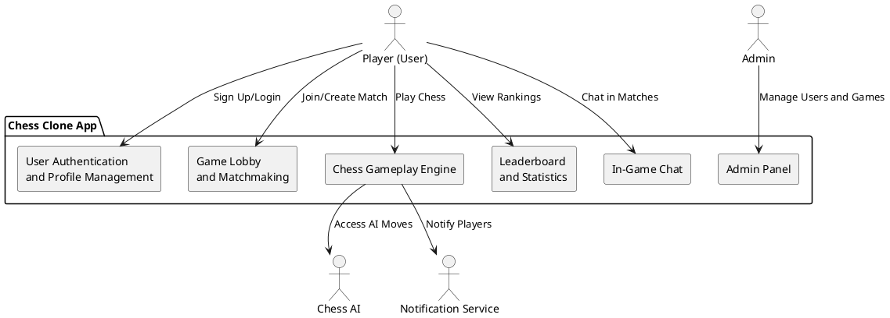
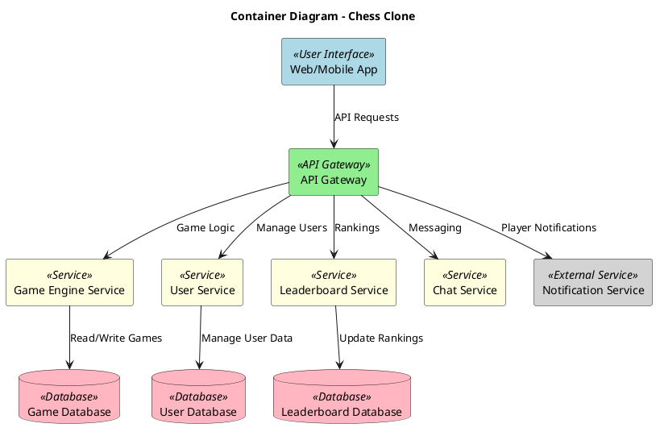
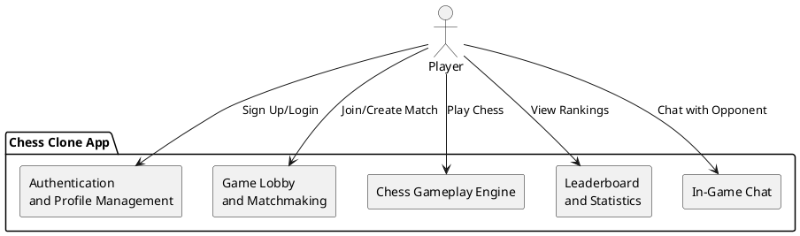
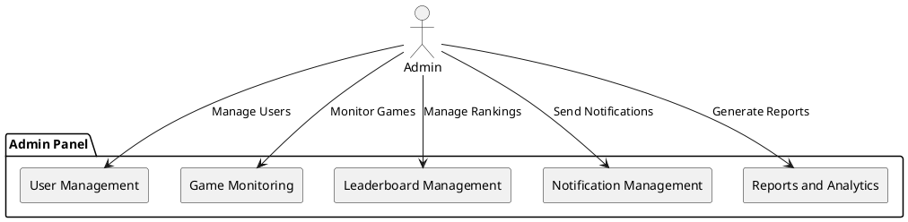
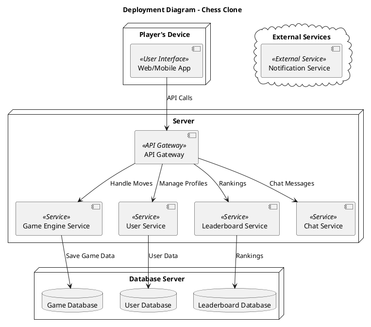

---

## 1. **System Context Diagram**

The System Context Diagram offers a high-level view of the **Chess Clone App** and its interactions with external actors and systems.

---
## 2. **Conatiner Diagram**

---

## 3. **Component Diagram**

### 3.1. **Component Diagram for Players**

---

### 3.2. **Component Diagram for Admins**

---

## 4. **Deployment Diagram**

.

