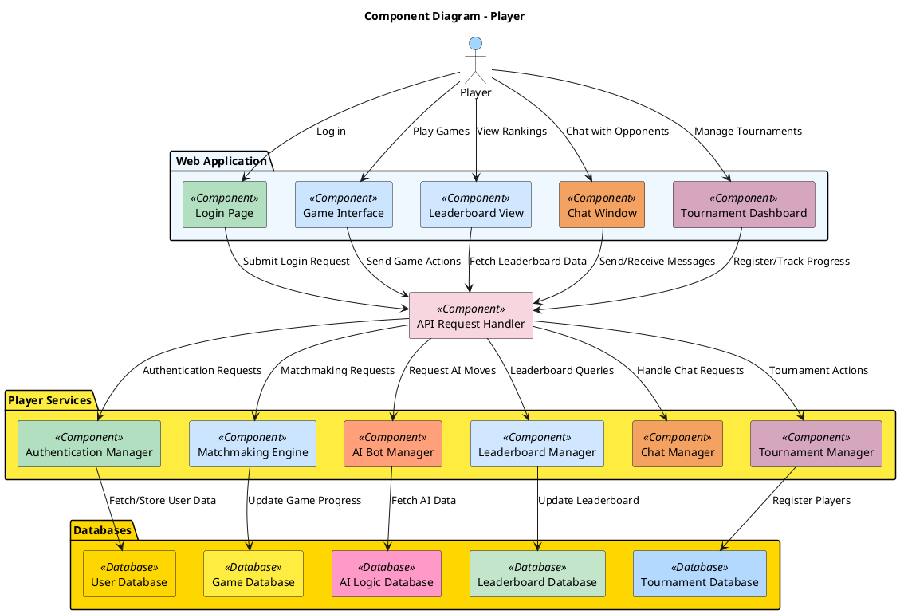
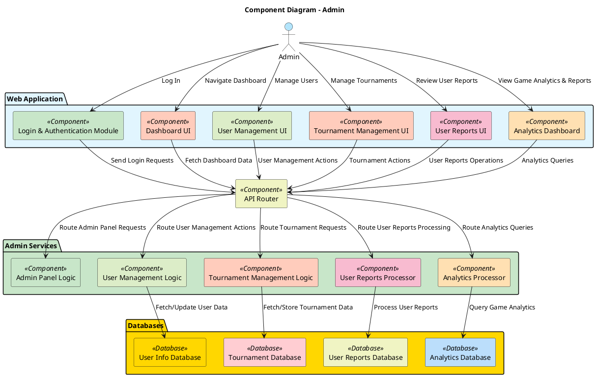
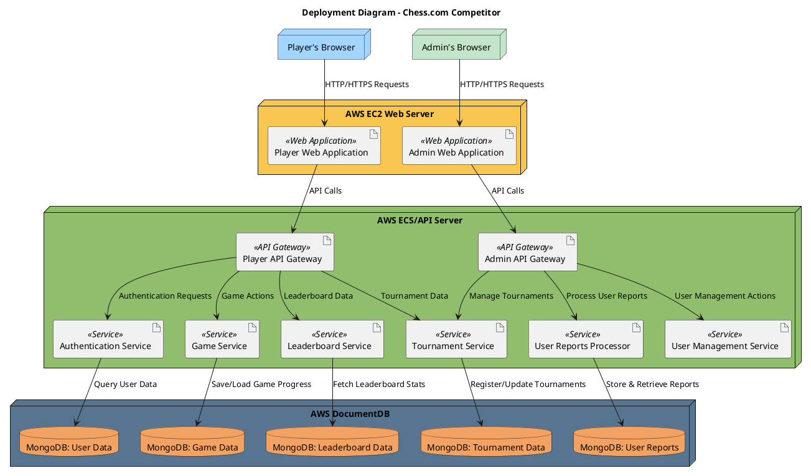

## 1. **System Context Diagram**


```plantuml
@startuml
!include https://raw.githubusercontent.com/RicardoNiepel/C4-PlantUML/master/C4_Context.puml

title System Context Diagram - Chess.com Competitor

Person(User, "Player", "Plays chess, chats, spectates")
Person(Admin, "Administrator", "Manages tournaments and the platform")
Person(Spectator, "Spectator", "Watches games and tournaments")

System(System, "Chess.com Competitor", "Provides chess gameplay, tournaments, and spectating")

System_Ext(SocialLogin, "Social Login Services", "Handles user authentication via social accounts")
System_Ext(ChessEngine, "Chess Engine API", "Provides move validation and analysis")
System_Ext(GDPR, "GDPR Authority", "Ensures compliance with data protection regulations")

User -> System : "Play Chess, Chat, Spectate"
Admin -> System : "Manage tournaments and platform"
Spectator -> System : "Watch live games and tournaments"
System -> SocialLogin : "Authenticate users"
System -> ChessEngine : "Validate moves, provide analysis"
System -> GDPR : "Compliance with data protection"

@enduml
```

---
## 2. **Container Diagram**


```plantuml
@startuml
!define C4P https://raw.githubusercontent.com/RicardoNiepel/C4-PlantUML/master
!include C4P/C4_Container.puml

title Container Diagram - Chess.com Competitor

Person(Player, "Player", "Plays chess, chats, and participates in tournaments")
Person(Admin, "Administrator", "Manages tournaments and platform settings")
Person(Spectator, "Spectator", "Watches live games and tournaments")

System_Boundary(ChessPlatform, "Chess.com Competitor") {
    Container(Frontend, "Frontend Application", "HTML/CSS/JavaScript", "Provides user interfaces for all users")
    Container(API, "Backend Server", "Node.js/Express", "Handles business logic, user management, and API endpoints")
    ContainerDb(Database, "Database", "MongoDB", "Stores user data, game history, leaderboards, and chat logs")
    Container(Realtime, "WebSocket Service", "WebSocket API", "Enables real-time gameplay, chat, and spectating")
    Container(StaticContent, "Static Content", "AWS S3", "Hosts static files such as frontend assets")
    Container(ChessEngine, "Chess Engine API", "External System", "Validates chess moves and provides AI-powered analysis")
    Container(Auth, "Authentication Service", "Amazon Cognito", "Handles secure user authentication and social login integration")
}

System_Ext(SocialLogin, "Social Login Services", "Handles user authentication via social accounts")
System_Ext(GDPR, "GDPR Authority", "Ensures compliance with data protection regulations")

Player -down-> Frontend : "Access platform via browser"
Admin -down-> Frontend : "Manages tournaments and settings"
Spectator -down-> Frontend : "Watches live games and tournaments"

Frontend -down-> API : "Requests gameplay, user, and tournament data"
Frontend -down-> Realtime : "Connects for live updates and real-time gameplay"
Frontend -down-> StaticContent : "Loads static assets"

API -down-> Database : "Stores and retrieves user data"
API -down-> ChessEngine : "Validates moves, requests AI analysis"
API -down-> Auth : "Authenticates users"
Realtime -down-> API : "Communicates game state and chat data"

API -down-> GDPR : "Ensures compliance with regulations"
Auth -down-> SocialLogin : "Handles third-party authentication"
Auth -down-> Database : "Stores user credentials"
@enduml
```

---


## 3. **Component Diagram**

### 3.1. **Component Diagram for Players**




---

### 3.2. **Component Diagram for Admins**





---

## 4. **Deployment Diagram**



