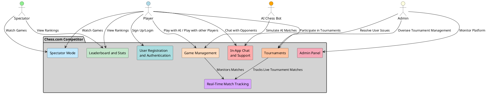
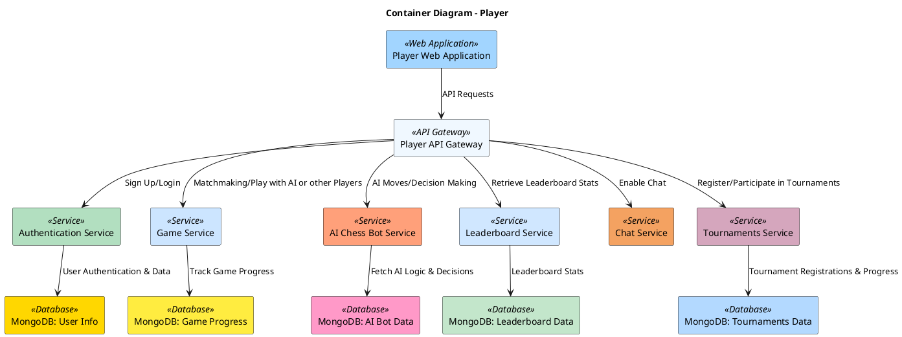
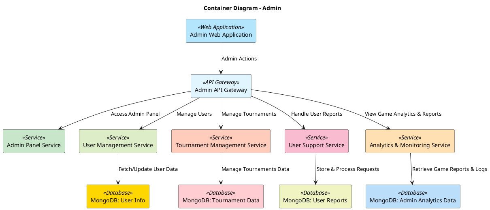
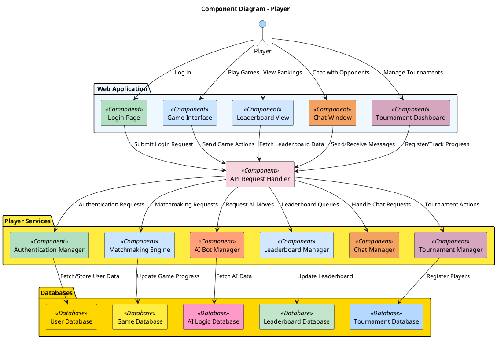
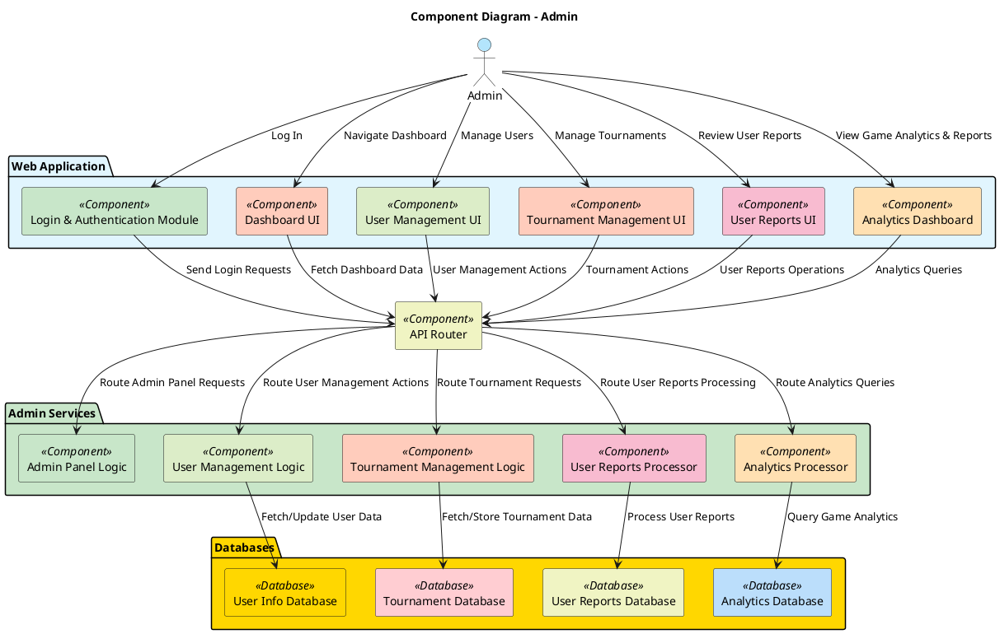
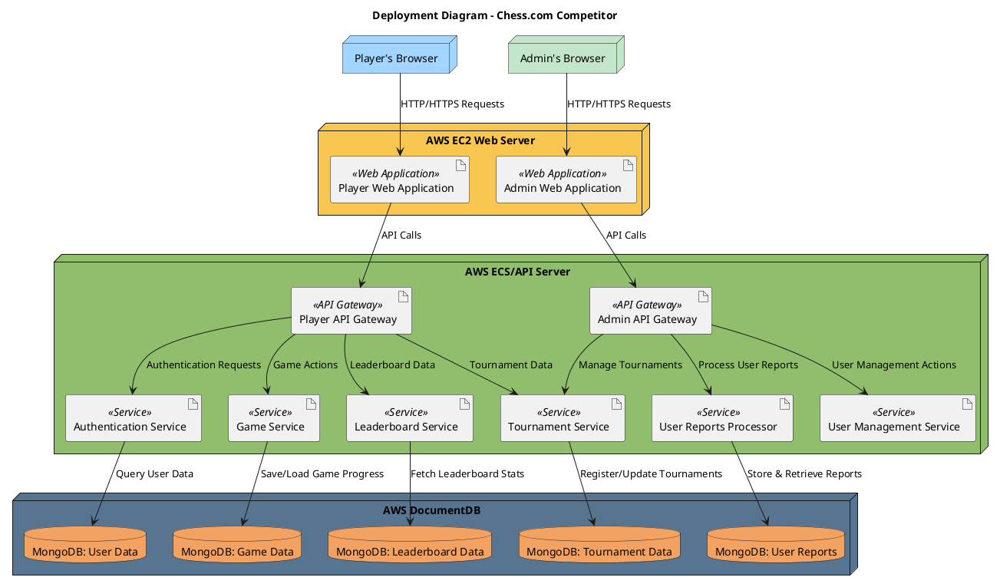

## 1. **System Context Diagram**

---
## 2. **Container Diagram**

### 2.1. **Container Diagram for Players**

---

### 2.2. **Container Diagram for Admins**

---

## 3. **Component Diagram**

### 3.1. **Component Diagram for Players**

---

### 3.2. **Component Diagram for Admins**

---

## 4. **Deployment Diagram**

