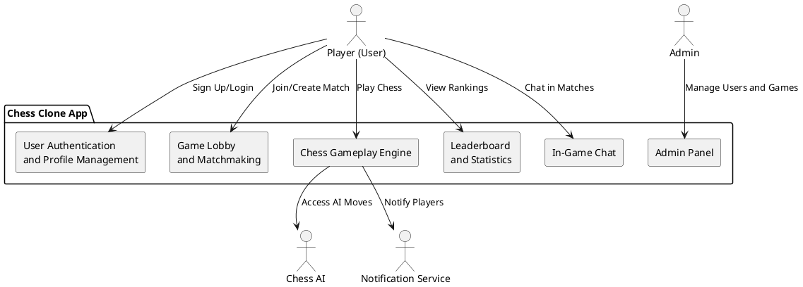
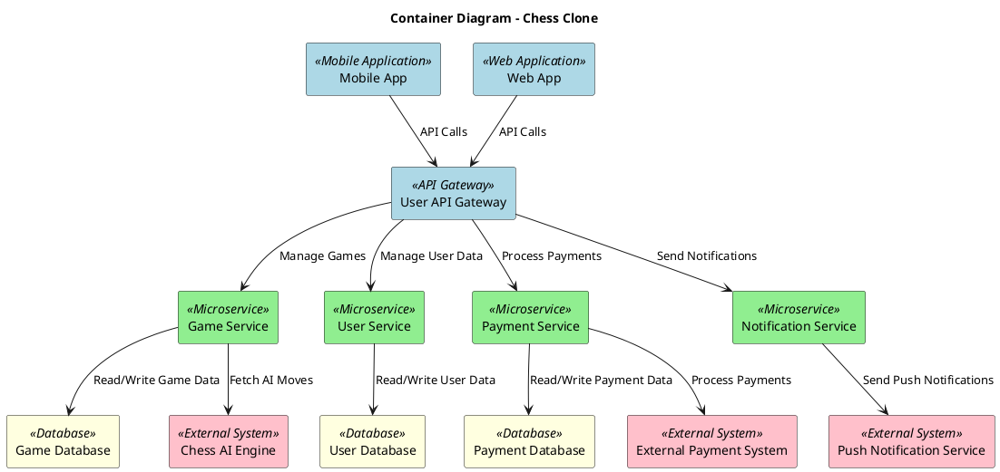

# **Software Design Description (SDD)**

## 1. **Introduction**

### 1.1 **Purpose**
The purpose of this Software Design Description (SDD) is to provide a detailed design for the Chess.com Clone system. This document outlines the architecture, components, interfaces, and their interactions to ensure that the implementation meets the system's functional and non-functional requirements.

### 1.2 **Scope**
The Chess.com Clone system enables users to play chess games online, create profiles, and compete in real-time matches. The system consists of the mobile/web application, backend services, game logic, player matchmaking, user authentication, payment processing, chat functionality, and external integrations such as chess AI engines for gameplay and notifications.

---

## 2. **System Overview**

The Chess.com Clone allows players to:
- Play real-time chess games against other players or AI.
- Chat with opponents during the game.
- View leaderboards and track statistics.
- Manage user profiles and settings.
- Participate in tournaments and challenges.

Admin users can:
- Manage users and games.
- View player statistics and reports.
- Monitor in-game activities and resolve issues.

---

## 3. **System Architecture**

### 3.1 **System Context Diagram**




---

### 3.2 **Container Diagram**

#### **Player and Admin Containers**




---

## 4. **Module Design**

### 4.1 **Mobile/Web Application (Frontend)**

#### 4.1.1 **User Interface (UI)**
The UI will provide an intuitive and responsive experience, with the following components:
- **Home Screen**: Displays navigation options and a summary of recent activities.
- **Game Screen**: Displays the chessboard and game interactions.
- **Profile Management**: Allows users to view and edit their profiles.
- **Leaderboard**: Displays rankings and statistics of players.
- **Matchmaking Screen**: Allows players to join or create matches.

#### 4.1.2 **Controller Layer**
The controller layer manages user requests and communicates with the backend services. It includes:
- **Game Controller**: Manages game logic and moves.
- **User Controller**: Handles user profile creation and authentication.
- **Payment Controller**: Manages in-app purchases and payment processing.
  
#### 4.1.3 **Service Layer**
The service layer is responsible for the business logic of the application, such as:
- **Game Service**: Handles match creation, move validation, and game state management.
- **User Service**: Manages player profiles, authentication, and account settings.
- **Payment Service**: Handles all payment-related processes.
- **Notification Service**: Sends notifications for game events.

---

### 4.2 **Backend System (Server-side)**

#### 4.2.1 **API Gateway**
The API Gateway handles requests from the frontend and forwards them to the appropriate services.

#### 4.2.2 **Authentication Service**
Manages:
- User registration
- User login
- Password reset functionality

#### 4.2.3 **Game Management Service**
Handles:
- **Game Creation**: Allows users to initiate new games.
- **Move Validation**: Ensures that moves made by players are valid according to the game rules.
- **Game State**: Tracks the state of ongoing games, including player turns and win conditions.

#### 4.2.4 **Leaderboard Service**
Maintains player rankings and statistics, allowing users to view and track progress.

#### 4.2.5 **Payment Service**
Handles in-app purchases, such as premium accounts, and integrates with external payment systems.

#### 4.2.6 **Notification Service**
Manages sending notifications related to game events (e.g., match start, opponent's move, etc.).

---

## 5. **Database Design**

### 5.1 **Schema Overview**

The Chess.com Clone uses a NoSQL database (e.g., MongoDB) to manage game data. The key entities in the database are:

- **Users**: Stores information such as name, email, password, and profile settings.
- **Games**: Stores details of ongoing and completed games, including moves, players, and game state.
- **Payments**: Tracks user payments, including payment methods and transaction history.
- **Leaderboard**: Stores player rankings and statistics.

### 5.2 **Entity-Relationship Diagram**

```
@startuml

entity user {
  *user_id: bigint(20)
  username: varchar(40)
  email: varchar(100)
  password: varchar(100)
  profile_picture: varchar(100)
}

entity game {
  *game_id: bigint(20)
  player_1_id: bigint(20)
  player_2_id: bigint(20)
  start_time: timestamp(3)
  end_time: timestamp(3)
  status: varchar(20)
}

entity move {
  *move_id: bigint(20)
  game_id: bigint(20)
  player_id: bigint(20)
  move_description: varchar(10)
  timestamp: timestamp(3)
}

entity payment {
  *payment_id: bigint(20)
  user_id: bigint(20)
  amount: decimal(10, 2)
  date: timestamp(3)
  payment_method: varchar(20)
}

entity leaderboard {
  *leaderboard_id: bigint(20)
  user_id: bigint(20)
  rank: int(10)
  points: int(10)
}

entity chat {
  *chat_id: bigint(20)
  game_id: bigint(20)
  user_id: bigint(20)
  message: varchar(255)
  timestamp: timestamp(3)
}

user ||--o{ game: "player 1"
user ||--o{ game: "player 2"
game ||--o{ move
game ||--o{ chat
user ||--o{ payment
user ||--o{ leaderboard

@enduml
```

---

## 6. **Interface Design**

### 6.1 **API Design**
Below are some of the key API endpoints for interaction:

- **POST /users/register**: User registration
- **POST /users/login**: User login
- **POST /games/start**: Start a new game
- **POST /games/move**: Make a move in a game
- **GET /games/status**: Get the status of a game
- **GET /leaderboard**: Retrieve player rankings

### 6.2 **External System Interfaces**
- **Payment Gateway**: Handles transactions for premium features (e.g., Stripe, PayPal).
- **Chess AI Engine**: Provides moves for AI-based gameplay.
- **Push Notification Service**: Sends notifications to players (e.g., Firebase, Twilio).

---

## 7. **Non-Functional Requirements**

### 7.1 **Performance**
The system should be capable of handling at least 5,000 concurrent users and ensure smooth gameplay.

### 7.2 **Scalability**
The backend system should support horizontal scalability to accommodate increasing traffic.

### 7.3 **Availability**
The system should maintain 99.9% uptime and provide failover mechanisms for critical components.

### 7.4 **Security**
- **Data Encryption**: All sensitive data, such as user passwords, should be encrypted.
- **Two-Factor Authentication**: Implement multi-factor authentication for user accounts.

---

## 8. **Conclusion**
This Software Design Description outlines the architecture, modules, database, and interfaces for the Chess.com Clone system. The design ensures the system is robust, scalable, and secure, capable of supporting a growing user base and providing real-time gaming features.

--- 
